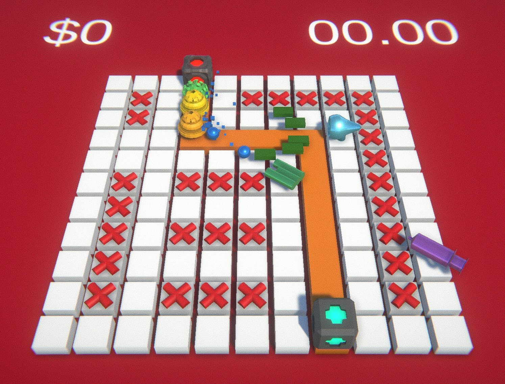

# **ImmunoFortress - Group H Tower Defence Game**

**ECS657U - Multi-platform Game Development - 2023/24**

**Using Unity Version 2023.1.0f1**

**ImmunoFortress** is a tower defense game developed as a final project for the Multi-platform Game Development course at Queen Mary University London. This game, set within the human body, combines strategic gameplay with an engaging narrative about fighting diseases.

**Access the game through:**

- **Web-GL Build:** [Play ImmunoFortress](https://speedyzozo.github.io/group-h-td/build/)
- **Unity Project:** [Github Repository](https://github.com/SPeedyZoZo/group-h-td)

**External Links**

- [**Gameplay Video**](https://www.youtube.com/watch?v=lpYYiHsxb9U&ab_channel=ZaidChughtai)
- [**Project Snapshot**](https://github.com/SPeedyZoZo/group-h-td/releases/tag/final)

**Game Concept**

- **Title:** ImmunoFortress
- **Concept:** Tower Defense (Document number 3-2)
- **Theme:** Set inside the human body, featuring a red-themed level design to mimic the internal environment. Enemies and towers are designed to represent viruses and defense apparatus, creating a biological feel.

**Changes Since Prototype**

- **Currency:** Transitioned to a dollar-based system for an arcade-style experience.
- **Assets:** Utilization of Unity's 3D models and original assets created using Blender, including music and graphics.
- **Story:** A narrative centered around helping a person combat a disease using towers to destroy viruses, bacteria, and pathogens.

**Intended Player Experience**

Engaging, strategic gameplay that challenges players to efficiently utilize towers, adjusting to increasing difficulty levels and diverse enemy types. The game offers adjustable difficulty settings to cater to different skill levels.

**Level Features**

- **Total Levels:** 5, increasing in difficulty.
- **Special Powers:** Fever and shiver powers introduced in the third and fourth levels, respectively.
- **Design:** Challenging levels with blocks marked with a red X to indicate non-buildable areas.

**Gameplay Features**

- **Environment:** Top-down 3D with clear enemy pathways.
- **Wave System:** Timer-based enemy spawning.
- **Economy:** Enemies drop cash stacks for resource accumulation.
- **Towers:** Three types with distinct abilities – Basic, Gatling, and Sniper.
- **Enemies:** Three types – Virus, Pathogen, and Bacteria, each with unique attributes.
- **Skill Tree Powers:** Fever and shiver powers available after certain levels.
- **HUD:** For tower and power selection, displaying costs and icons.

**Non-playable Features**

- **Story:** Progression of fighting a deadly disease.
- **Settings Menu:** Customizable music, sound effects, and difficulty.

**Aesthetics**

Arcade-style menus, retro post-processing, and blocky particle effects create a unique and immersive game environment.

**Controls**

Use the mouse to interact:

- **Place Towers:** Left-click on a tile to place a tower.
- **Tower Actions:** Towers auto-attack enemies within range.
- **Gameplay:** Protect your base from enemy waves, manage resources, and strategize tower placement.

**Development Team**

- Zaid Kareem Chughtai  -  [@SPeedyZoZo](https://github.com/SPeedyZoZo)
- Benno Price  -  [@bennoprice](https://github.com/bennoprice)
- Juan Roca Fabregat  -  [@itsjrf](https://github.com/itsjrf)
- Tomas Albiol Garcia-Munte  -  [@tomas-AGM](https://github.com/tomas-AGM)
